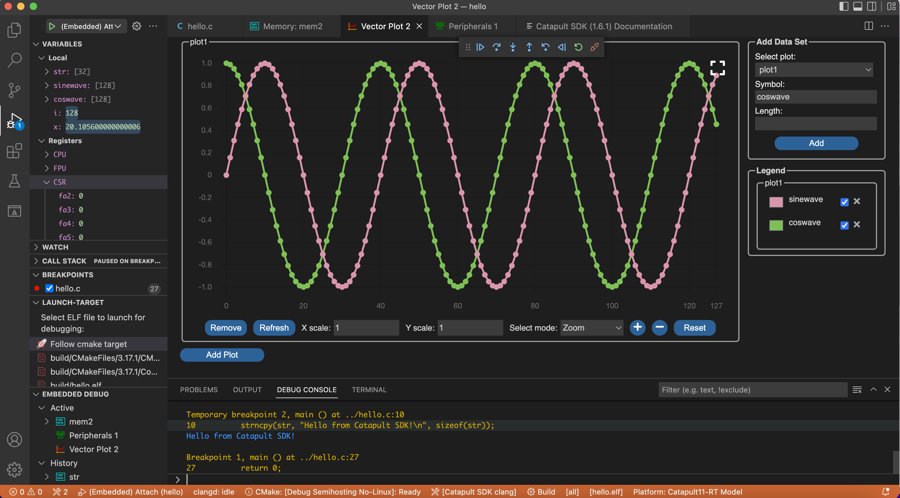

# Catapult SDK
Imagination Technologies' RISC-V Software Development Kit (Catapult SDK) is a curated package of tools and software for developers working with RISC-V CPUs.  We aim to supply all the basic components you need to develop and debug your system, no matter whether you are working with an Imagination Technologies CPU, or one from another vendor.  This repo doesn't currently contain source code: we use it for distributing the SDK and managing issues.  The SDK is free to download, subject to our End User Licence Agreement.

## Overview of the SDK
The main components of the SDK are:
- [gcc][2] and [LLVM][3] (Clang) compilers for RISC-V.  We regularly update these from the upstream open-source repositories, and thoroughly test the released binaries with extensive test suites.  The LLVM compiler also contains modifications from our own compiler team which may not yet have been upstreamed (e.g. optimizations for Imagination Technologies CPUs).
- C/C++ libraries.  We offer [picolibc][4] for bare-metal development, and both [glibc][5] and [musl][6] for Linux development.  Again, these may contain performance enhancements from our developer team which have not yet been upstreamed.
- [gdb][7] and [OpenOCD][8] for RISC-V debugging; and files to configure these with knowledge of all supported platforms.
- [binutils][9] and [pyelftools][10] for analysis and manipulation of .elf files etc.
- Source code such as examples, platform-specific header files, and the [FreeRTOS][11] operating system.
- System start-up code for all supported platforms.
- **ldgen**, a tool for auto-generating linker scripts, providing an easy way of creating customized code and data memory layouts.
- Functional models of Imagination Technologies Alpine and Catapult CPUs, and the [VeeR Instruction Set Simulator][1] (Whisper).
- **Catapult Studio**, our Integrated Development Environment, described in the next section.

## The Catapult Studio IDE
Catapult Studio is a customized version of [Visual Studio Code][14], one of today's most popular development environments.  Our customizations focus on the needs of embedded software developers working with remote RISC-V targets using C/C++.  Some of the main features are:
- Close integration with the rest of the SDK.
- Automated systems for connecting to remote RISC-V platforms and launching debugging sessions on such targets (typically via JTAG / OpenOCD).
- Full-featured, editable memory window.
- Peripheral registers window.
- Comprehensive, integrated documentation.
- Data visualization (vector plot) window.
- Disassembly window: shows disassembly interspersed with high-level code and allows breakpointing and stepping through the assembler code.
- Platform selection feeds knowledge of the platform (such as memory and register maps) into gdb, OpenOCD and the other Catapult Studio windows; and optionally into your build.
- Graphical interface for specifying platform characteristics and connection methods; with facility to create your own platforms or install new platforms through a platform support pack.
- Strong support for the CMake build system; although will work with other build systems of your choice.
- "Intellisense" for editing C/C++ code, with syntax highlighting, jump between references, tool-tips with help on function prototypes, auto-completion, and more.


*Catapult Studio*

## Installing and Using the SDK
Download the installer for the host platform of your choice from our releases area.  Supported host systems are: Ubuntu 64-bit x86 (18.04/20.04/22.04); CentOS 7 x86_64; Windows 10/11 64-bit; and MacOS (Catalina onwards, x86 and Arm M1).  Then follow the instructions below to install.

Following the installation you will find full details on how to use the SDK in the user documentation which can be accessed in 2 ways:
- Within Catapult Studio, select Help→Get Started, then click the link for the Catapult SDK Documentation. Alternatively, you can select "Catapult: Open SDK Documentation" from the command palette (CTRL-P, or CMD-P on Mac).
- Outside of Catapult Studio, on MacOS or Linux, click the docs link under catapult-sdk_examples/{version} in your home area.  On Windows, you will find a .pdf file in the docs directory of the toolkit installation.

To use the SDK tools (as listed above) on the command line, you should add the bin directory within the SDK installation (catapult-sdk.app/Contents/Helpers/bin on mac)  to the beginning of your PATH environment variable.

The SDK also includes the [cmake][12] and [ninja][13] build tools.  If you would like to use the SDK versions of these, add the build/bin directory (catapult-sdk.app/Contents/Helpers/build/bin on mac) to PATH also.

### Linux .deb Installation
Use apt:
```
sudo apt update
sudo apt upgrade
sudo apt install catapult-sdk_{version}.deb
```

### Linux .rpm Installation
On CentOS 7, use yum:
```
sudo yum localinstall catapult-sdk-{version}-1.x86_64.rpm
```
On Fedora 22 and above, use dnf:
```
sudo dnf install catapult-sdk-{version}-1.x86_64.rpm
```
To unpack the contents of the RPM to a local directory without needing root privileges, use:
```
rpm2cpio catapult-sdk-{version}-1.x86_64.rpm | cpio -id
```
This will extract the SDK into a directory opt/imgtec/catapult-sdk_{version} under the current working directory. Note that this works on Ubuntu as well as CentOS.

### Windows Installation
To install on Windows, simply double-click the catapult-sdk_setup_win32_x64_{version}.exe application and the installer wizard will guide you through the setup process.

You will be given the option to install for all users (that requires administrator privileges) or for just yourself (which does not).

### MacOS Installation
To allow the install, first go to the Security and Privacy section of System Preferences, General tab, and enable "Allow apps downloaded from Apple and selected developers" (if you haven't already done that previously).  Then simply double-click the installer package and you will be guided through the install process.

The application installs to the /Applications folder by default.  Double-clicking the installed application brings up the Catapult Studio IDE.  The welcome page contains links to toolkit documentation.

Apple's XCode command-line developer tools are a requirement for using the toolkit.  If you don't already have these installed on your system, the installer will prompt to offer to install them.

[1]: https://github.com/chipsalliance/VeeR-ISS
[2]: https://gcc.gnu.org/
[3]: https://llvm.org/
[4]: https://github.com/keith-packard/picolibc
[5]: https://www.gnu.org/software/libc/
[6]: https://musl.libc.org/
[7]: https://www.gnu.org/software/gdb
[8]: http://openocd.org/
[9]: https://www.gnu.org/software/binutils
[10]: https://github.com/eliben/pyelftools
[11]: https://www.freertos.org/
[12]: https://cmake.org
[13]: https://ninja-build.org
[14]: https://code.visualstudio.com/
